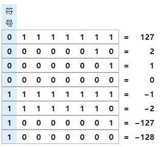

# 整数

  整数分为有符号整数（signed int）和无符号整数(unsigned int)，位宽会随系统而变。在工作中一般使用头文件`stdint.h`里的类型，如`uint32_t`或`int32_t`，如此位宽已展示出来，就不用考虑这方面平台对运行结果的影响。以下如无特别说明，默认整数类型的宽度为32。

无符号整数表示的范围是0~$2^{32}$-1，每一位数字乘上对应权重再累加，就可以得到10进制的值。权重从最低有效位（Least Significant Bit, LSB）开始依次为1， 2， 4，……。有符号整数表示的范围是的最高有效位（Most Significant Bit, MSB）是符号位，0表示正数（包括数值0），1表示负数。正整数和0相当于无符号整数加上0（比特）作为MSB。负数是以补码加上符号位的形式存在内存中，补码是对二进制数取反再加1的操作。忽略负号，将负数的数字部分取补码，最后加上符号位就是负数在内存中的值。细心一点可以发现如果把0当做负数来存储，虽然会有溢出，但低32位都是0，所以可认为0的补码和原码是一样的。实际上如果把符号位的权重看成是-$2^{31}$，低31位的权重不变，负数仍然可以按照前面提到的方法计算10进制的值。对于负数，数据部分全1表示-1，全0表示-$2^{31}$，随着数值减小，数据部分的二进制值是减小的。

# 浮点数

浮点数有32位的单精度(float)和64位的双精度(double)两种形式，具体存储形式**类似于**科学计数法，如1.01*$10^{15}$。根据IEEE754规定，从MSB到LSB，

- float依次为符号位S（1位）、指数E（8位）、有效数M（23位）
- double依次为符号位S（1位）、指数E（11位）、有效数M（52位）

但计算机是以2为底数的，即浮点数的计算为$(-1)^S$\*M*$2^{E}$。记实际在内存中，二进制数分别为s, e, m，符号位S和s是一致的，另外两个数有较大区别。指数也是有符号的，如果单纯把E当做有符号整数进行存储，也能正常使用，但与前面的整数存储看起来不太一致。以float为例，忽略有效数M的具体数值，如果E是有符号整数，且它的符号位为1，如*0x010000000*。如果这个数是无符号整数的高9位，则代表一个比$2^{30}$还要大的整数；但对于float，指数表示$2^{-128}$，是个很小的数。为了更好地兼容整数的表示方式，不把指数的MSB当做符号位，引入了偏移的计算方式。

浮点数的指数M还有规则化和非规则化两种形式，对应两种M计算方式。若M全0或全1，则为非规格化的值；否则为规则化。记内存中指数部分表示的无符号整数是e，若指数位宽是n，偏移Bias为$2^{n-1}$-1。选择$2^{n-1}$-1而不是$2^{n-1}$作为偏移，好处是某个浮点数的倒数也在浮点数的范围内。规则化形式中：E=e-Bias，M的整数部分是1；非规则化形式且e为全0时：E=1-Bias，M的整数部分是0。例如+0为*0x0*，-0是*0x80000000*。对于e为全1这种非规则化形式，就不用考虑Bias，若m为全0，则表示无穷，像是除0或一些极大的计算结果；不为全0表示NaN，如非实数或无穷与无穷的计算。

浮点数只满足加法和乘法的交换律，不满足结合律和分配律，还有在保留几位小数是会向偶数取整的操作。
